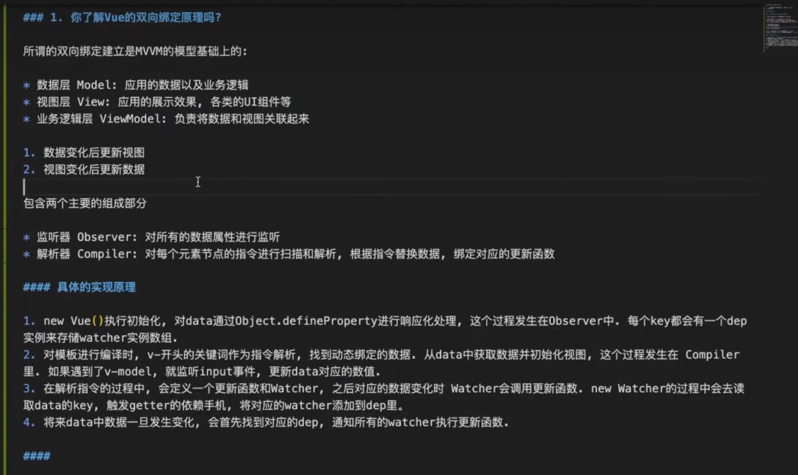

## 深入浅出虚拟 DOM 和 Diff 算法，及 Vue2 与 Vue3 中的区别

1. 事件缓存：将事件缓存，可以理解为变成静态的了

2. 添加静态标记：Vue2 是全量 Diff，Vue3 是静态标记 + 非全量 Diff

3. 静态提升：创建静态节点时保存，后续直接复用

4. 使用最长递增子序列优化了对比流程：Vue2 里在 updateChildren() 函数里对比变更，在 Vue3 里这一块的逻辑主要在 patchKeyedChildren() 函数里

5. Vue3.0 中对这些 API 做出了调整：

   - 将全局的 API，即：`Vue.xxx`调整到应用实例（`app`）
   - 移除`keyCode`作为 `v-on` 的修饰符，同时也不再支持`config.keyCodes`
   - 移除`v-on.native`修饰符、移除`v-on.native`修饰符
   - 过渡类名的更改 v-enter-from,

   ## 什么是虚拟 DOM，以及他的优点

   答：虚拟 DOM 到底是什么，说简单点，就是一个普通的 JavaScript 对象，包含了?`tag`、`props`、`children`?三个属性。

   虚拟 DOM 提升性能的点在于 DOM 发生变化的时候，通过 diff 算法比对 JavaScript 原生对象，计算出需要变更的 DOM，然后**只对变化的 DOM 进行操作**，而**不是更新整个视图**。

   缺点：1.首次渲染大量 dom 的时候，由于多了一层虚拟 dom 的计算，会比 innerHTML 的插入速度慢

   ​ 2.做一些针对性的优化的时候，真是 dom 的操作还是更快一点的

   # Symbol

   1. 用来解决属性名冲突的问题，构造唯一的属性名或变量。 2. 私有属性 「遍历是拿不到 key 所以私有属性」

   #### 具体如何让一个对象可遍历呢？ 加迭代器可以遍历

   ​ 利用 JSON.parse()、JSON.stringify()这两个方法实现深拷贝

   1. JSON.stringify() 会忽略 Symbol 、undefined、function
   2. 如果对象有循环引用，不能用 JSON.stringify 来处理， stringify()会报错

### Vue3.0 中的响应式原理

实现原理

- 通过 `Proxy`（代理）: 拦截对象中任意属性的变化, 包括：属性值的读写、属性的添加、属性的删除等。
- 通过`Reflect`（反射）: 对源对象的属性进行操作。

### `reactive`对比`ref`

- 从定义数据角度对比
  - `ref`用来定义：**基本类型数据**。
  - `reactive`用来定义：**对象（或数组）类型数据**。
  - 备注：`ref`也可以用来定义**对象（或数组）类型数据**, 它内部会自动通过`reactive`转为**代理对象**。
- 从原理角度对比

  - `ref`通过类中的的`getter`与`setter`来实现响应式（数据劫持）。
  - `reactive`通过使用**Proxy**来实现响应式（数据劫持）, 并通过**Reflect**操作**源对象**内部的数据。

  > [!TIP]1.ref 可以为基本类型添加响应式，也可以为
  > 引用类型添加响应式，reactive 只能为引用
  > 类型添加响应式。

  > [!TIP]2.对于引用类型，什么时候用 ref，什么时候用 reactive？简单说，如果你只打算修改引用类型的一个属性，那么推荐用 reactive,如果你打算变量重赋值，那么一定要用 ref。

## Vue2.x 的响应式

实现原理

- 对象类型：通过`Object.defineProperty()`对属性的读取、修改进行拦截（数据劫持）。
- 数组类型：通过重写更新数组的一系列方法来实现拦截。（对数组的变更方法进行了包裹）。

存在问题

- **新增**属性、**删除**属性, 界面不会更新。
- 直接通过**下标修改**数组, 界面不会自动更新。

解决方案

- 使用`Vue.set`、`Vue.delete`或者`vm.$set`、`vm.$delete`这些 API

## Vue3 中 composition API 的使用与原理

- Vue3 可以更好的支持`TypeScript`

- Composition API 的优势 我们可以更加优雅的组织我们的代码，函数。让相关功能的代码更加有序的组织在一起。

- `provide` 与 `inject`

  - 作用：实现**祖与后代组件间**通信
  - 套路：父组件有一个 `provide` 选项来提供数据，后代组件有一个 `inject` 选项来开始使用这些数据

  #### `watch`函数

  - 与 Vue2.x 中`watch`配置功能一致
  - 两个小“坑”：
    - 监视`reactive`定义的响应式数据时：`oldValue`无法正确获取、强制开启了深度监视（`deep`配置失效）。
    - 监视`reactive`定义的响应式数据中某个属性时：`deep`配置有效。

  情况一：监视 ref 定义的响应式数据

  ```javascript
  //情况一：监视ref定义的响应式数据
  watch(
    sum,
    (newValue, oldValue) => {
      console.log('sum变化了', newValue, oldValue)
    },
    { immediate: true }
  )
  ```

  情况二：监视多个 ref 定义的响应式数据

  ```javascript
  watch([sum, msg], (newValue, oldValue) => {
    console.log('sum或msg变化了', newValue, oldValue)
  })
  ```

  情况三：监视 reactive 定义的响应式数据

  - 若 watch 监视的是 reactive 定义的响应式数据，则无法正确获得 oldValue！！
  - 若 watch 监视的是 reactive 定义的响应式数据，则强制开启了深度监视

  ```javascript
  watch(
    person,
    (newValue, oldValue) => {
      console.log('person变化了', newValue, oldValue)
    },
    { immediate: true, deep: false }
  ) //此处的deep配置不再奏效
  ```

  情况四：监视 reactive 定义的响应式数据中的某个属性

  ```javascript
  //情况四：监视reactive定义的响应式数据中的某个属性
  watch(
    () => person.job,
    (newValue, oldValue) => {
      console.log('person的job变化了', newValue, oldValue)
    },
    { immediate: true, deep: true }
  )
  ```

  情况五：监视 reactive 定义的响应式数据中的某些属性

  ```javascript
  //情况五：监视reactive定义的响应式数据中的某些属性
  watch(
    [() => person.job, () => person.name],
    (newValue, oldValue) => {
      console.log('person的job变化了', newValue, oldValue)
    },
    { immediate: true, deep: true }
  )
  ```

  #### `watchEffect`函数

  - `watch`的套路是：既要指明监视的属性，也要指明监视的回调。
  - `watchEffect`的套路是：不用指明监视哪个属性，监视的回调中用到哪个属性，那就监视哪个属性。
  - `watchEffect`有点像`computed`：
    - 但`computed`注重的计算出来的值（回调函数的返回值），所以必须要写返回值。
    - 而`watchEffect`更注重的是过程（回调函数的函数体），所以不用写返回值。

  ## 响应式数据的判断

  - `isRef`: 检查一个值是否为一个 `ref` 对象
  - `isReactive`: 检查一个对象是否是由 `reactive` 创建的响应式代理
  - `isReadonly`: 检查一个对象是否是由 `readonly` 创建的只读代理
  - `isProxy`: 检查一个对象是否是由 `reactive` 或者 `readonly` 方法创建的代理

### ① 拉开序幕的`setup`

1. 理解：Vue3.0 中一个新的配置项，值为一个函数。

2. `setup`是所有**Composition API（组合 API）\***“ 表演的舞台 ”\*。

3. 组件中所用到的：**数据**、**方法**等等，均要配置在`setup`中。

   setup 函数的两种返回值：

   1. 若返回一个对象，则对象中的属性、方法, 在模板中均可以直接使用。（重点关注！）
   2. 若返回一个渲染函数：则可以自定义渲染内容。

# 新的组件

### 1. `Fragment`

- 在 Vue2 中: 组件必须有一个根标签
- 在 Vue3 中: 组件可以没有根标签, 内部会将多个标签包含在一个`Fragment`虚拟元素中
- 好处: 减少标签层级, 减小内存占用

### 2. `Teleport`

- 什么是`Teleport`？—— `Teleport` 是一种能够将我们的**组件 html 结构**移动到指定位置的技术。

### 3. `Suspense`

- 等待异步组件时渲染一些额外内容，让应用有更好的用户体验
- default：就是组件要显示的内容
- fallback：就是组件没加载完全的“备胎”


