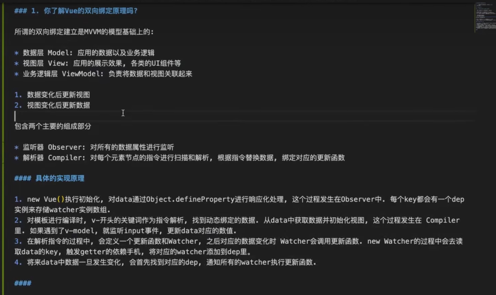

## 父子组件生命周期执行顺序

-父 beforeCreate-> 父 create -> 子 beforeCreate-> 子 created -> 子 mounted -> 父 mounted

## 更新阶段

父 beforeUpdate->子 beforeUpdate->子 updated->父 updated

## vue 中生命周期

beforeCreate 、created 、beforeMount 、mounted 、beforeUpdate 、updated 、beforeDestroy 、destroyed

## method ，computed，watch 的区别？

- method 是对函数的调用，computed 是对属性的调用。methods 方法页面刚加载时调用一次，以后只有被调用的时候才会被调用。

- computed 具有缓存功能，在系统刚运行的时候调用一次。只有只有当计算结果发生变化才会被调用。computed 对于其中变量的依赖是多个的，它的函数中使用了多个 this.xxx ,只要其中一个发生了变化，都会触发这个函数。

- 而 watch 的依赖则是单个的，它每次只可以对一个变量进行监控。

## watch 与 computed 的区别

作用：两者都可以用来监听属性的变化。

computed：根据其他依赖的属性，来形成新的属性；

watch:用来监听 data 或 props 属性中数据的变化，从而触发相关操作；

区别：

##### computed：

1、是基于 data 中声明过或父组件传递的 props 中的数据计算得到的；

2、computed 结果会被缓存，只有当依赖的数据发生变化才会重新计算；

3、不支持异步，当 computed 内有异步操作时无效，无法监听数据的变化；

4、computed 中的属性有 get 和 set 方法，但是默认走 get 方法。

##### watch：

1、watch 监听的数据必须是 data 中声明过或父组件传递的 props 中的数据；

2、watch 不会被缓存，当监听的数据变化时，直接出发响应的操作。

3、支持异步

4、watch 方法中有两个属性：immediate（组件加载立即触发方法），deep（深度监听）

5、使用场景：需要执行异步操作，或者开销较大的操作。

## vuex 中 mutations 和 actions 的区别和用法

答：mutations\*\*--commit 触发(更改 Vuex 的 store 中的状态的唯一方法是提交 mutation。也就是说，mutations 才是改变状态的执行者。 注意：mutations 只能是同步地更改状态.)

**,actions --dispatch 触发**(action 类似于 mutation, 不同在于：action 提交的是 mutation,而不是直接变更状态 action 可以包含任意异步操作 vue 中 ajax 请求代码应该写在组件的 methods 中还是 vuex 的 action 中。 )

## Axios

- 支持 Promise API

- ## 拦截请求和响应

- ## 转换请求数据和响应数据

- ## 自动转换 JSON 数据

  创建单独文件来封装 axios，封装的同时，你需要和 后端 协商好一些约定，请求头 ， 状态码, 请求超时时间…….
  引入必要的 UI 提示框, 不同的状态码，提示不同的响应，
  请求头 : 来实现一些具体的业务，必须携带一些参数才可以请求(例如：会员业务)
  状态码 : 根据接口返回的不同 status ， 来执行不同的业务，这块需要和后端约定好。
  请求拦截器: 根据请求的请求头设定，来决定哪些请求可以访问。
  响应拦截器：这块就是根据 后端 返回来的状态码判定执行不同业务

**配置拦截器**

> [!TIP] 请求拦截器
> instance.interceptors.request.use(req=>{}, err=>{});   响应拦截器
> instance.interceptors.reponse.use(req=>{}, err=>{});

**fetch Vs axios**

**axios**
支持浏览器和 nodejs 发请求前后端发请求，

支持 promise 语法

支持自动解析 json

支持中断请求

支持拦截请求

支持请求进度监测

支持客户端防 u 止 csrf

**fetch**

优点: 1.浏览器级别原生支持的 api

2.原生支持 promise api

3.语法简洁、符合 es 标准规范
缺点:

1.不支持文件上传进度监测

2.使用不完美需要封装

3.不支持请求中止

4.默认不带 cookie

## Set 和 Map 数据结构的区别

Set：没有重复的值，结构没有键名，只有键值。

Map：avaScript 的对象（Object），各种类型的值（包括对象）都可以当作键

## Vue nextTick 原理

nextTick 中的回调是在下次 DOM 更新循环结束之后执行的延迟回调。在修改数据之后立即使用这个方法，获取更新后的 DOM。主要思路就是采用微任务优先的方式调用异步方法去执行 nextTick 包装的方法

> [!TIP]使用场景
> 在数据变化后要执行某个操作，而这个操作依赖因你数据变化而改变的 dom

## 0bject . def ineProperty.

1.组件中对响应的数据进行了修改，会触发 setter 逻辑。

2.dep. notify()

3.遍历所有 subs,调用每-个 watcher 的 update 方法。

> [!TIP]总结原理:
> 当创建 vue 实例时，vue 会遍历 data 里的属性，0bj ect . def ineP roperty 为属性添加 gette r 和 sette r 对数据的读取进行劫持.
> getter:依赖收集
> setter:派发更新
> 每个组件的实例都会有对应的 watcher 实例.
> 
