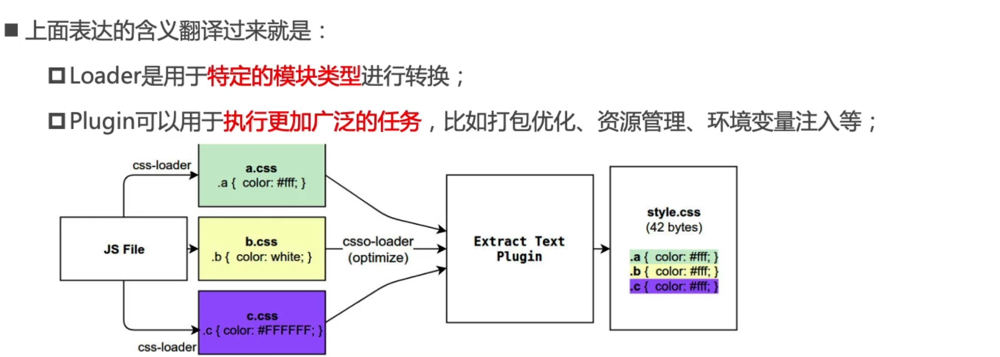

## webpack 与 gulp 的区别？

答：gulp 是基于任务的构建工具，webpack 是基于配置的构建工具

## chunk 和 bundle 的区别是什么？

## chunk

chunk 是 webpack 打包过程中 Modules 的集合，是「打包过程中」的概念。

Webpack 的打包是从一个入口模块开始，入口模块引用其他模块，其他模块引用其他模块......

Webpack 通过引用关系逐个打包模块，这些 module 就形成一个 chunk

如果有多个入口模块，可能会产出多条打包路，每天路径都会形成一个 chunk

## bundle

是我们最终输出的一个或者多个打包好的文件

## chunk 和 bundle 的关系是什么？

大多数情况下，一个 chunk 会产生一个 bundle ，但也不列外

但是如果加了 sourcemap ，一个 entry，一个 chunk 对应 两个 bundle

Chunk 是过程中代码块，Bundle 是打包结果输出的代码块 Chunk 在构建完成就呈现为 Bundle

## webpack 的工作原理？

1. 初始化参数：shell webpack.config.js
2. 开始编译：初始化一个 Compiler 对象，加载所有的配置，开始执行编译
3. 确定入口：根据 entry 中的配置，找出所有的入口文件
4. 编译模块：从入口文件开始，调用所有的 loader，再去递归的找依赖
5. 完成模块编译：得到每个模块被翻译后的最终内容以及他们之间的依赖关系。
6. 输出资源：根据得到依赖关系，组装成一个包含多个 module 的 chunk
7. 输出完成：根据配置，确定要输出的文件名以及文件路径

## Plugin 和 Loader 分别是做什么的？怎么工作的？

## Loader

模块转换器，将非 js 模块转化为 webpack 能识别的 js 模块

本质上，webpack loader 将所有类型的文件，转换为应用程序的 依赖图 可以直接引用的模块。

## Plugin

扩展插件，webpack 运行的各个阶段，都睡广播出对应的事件，插件去监听对应的事件

> [!TIP] 

## Compiler

对象，包含了 webpack 环境的所有配置信息，包含了 options loader ，plugins.webpack 启动的时候实例化，它在全局是唯一的，可以把它理解为 webpack 的实例

## Compliation

包含了当前的模块资源，编译生成资源。

webpack 在开发模式下运行的时候，没当检测一个文件变化，就会创建一次新的 Compliation

## 常见的 loader 有哪些？

`image-loader`：加载并且压缩图片文件。

`less-loader`： 加载并编译 LESS 文件。

`sass-loader`：加载并编译 SASS/SCSS 文件。

`css-loader`：加载 CSS，支持模块化、压缩、文件导入等特性，使用`css-loader`必须要配合使用`style-loader`。

`style-loader`：用于将 CSS 编译完成的样式，挂载到页面的 style 标签上。需要注意 `loader` 执行顺序，`style-loader` 要放在第一位，`loader` 都是从后往前执行。

`babel-loader`：把 ES6 转换成 ES5

`postcss-loader`：扩展 CSS 语法，使用下一代 CSS，可以配合 `autoprefixer` 插件自动补齐 CSS3 前缀。

`eslint-loader`：通过 ESLint 检查 JavaScript 代码。

`vue-loader`：加载并编译 Vue 组件。

`file-loader`：把文件输出到一个文件夹中，在代码中通过相对 URL 去引用输出的文件 (处理图片和字体)

`url-loader`：与 `file-loader` 类似，区别是用户可以设置一个阈值，大于阈值会交给 `file-loader` 处理，小于阈值时返回文件 base64 形式编码 (处理图片和字体)

## 常见的 plugin 有哪些？

`HtmlWebpackPlugin`：简化 HTML 文件创建 (依赖于 html-loader)

`mini-css-extract-plugin`: 分离样式文件，CSS 提取为独立文件，支持按需加载 (替代 extract-text-webpack-plugin)

`clean-webpack-plugin`: 目录清理

## webpack 的热更新原理是？

`模块热替换(HMR - hot module replacement)`，又叫做`热更新`，在不需要刷新整个页面的同时更新模块，能够提升开发的效率和体验。热更新时只会局部刷新页面上发生了变化的模块，同时可以保留当前页面的状态，比如复选框的选中状态等。

## 如何提高 webpack 的构建速度？

1. 代码压缩。 JS 压缩、CSS 压缩、HTML 压缩

2. 图片压缩。

3. 缩小打包域

   <!--排除`webpack`不需要解析的模块，即在使用`loader`的时候，在尽量少的模块中去使用。可以借助 `include`和`exclude`这两个参数，规定`loader`只在那些模块应用和在哪些模块不应用。-->

4. 图片压缩

   配置`image-webpack-loader`

## webpack.ensure 的原理

就是 把一些 js 模块给独立出一个个 js 文件，然后需要用到的时候，在创建一个 script 对象，加入到 document.head 对象中即可，浏览器会自动帮我们发起请求，去请求这个 js 文件，在写个回调，去定义得到这个 js 文件后，需要做什么业务逻辑操作。
